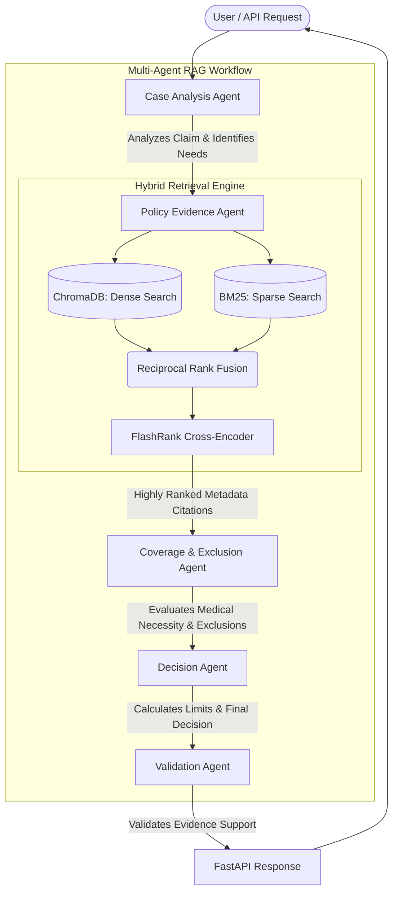

# Policy-Aware Multi-Agent RAG Claim Decision Engine

This repository contains a production-style, multi-agent RAG system built to evaluate health insurance claims against authoritative policy documents. 

Designed to meet the rigorous standards of modern AI engineering, it emphasizes **strict evidence grounding**, **explicit policy citations**, and **deterministic abstention** (`NEEDS_REVIEW`) over relying on LLM hallucinations. The system operates on a 100% free-tier, CPU-optimized technology stack using local embeddings and rerankers.

---

## 🔗 Live Application Links

You can test and interact with the deployed application via the following links:

1. **Frontend (Streamlit):** [https://policy-aware-multi-agent-rag-claim-decision.streamlit.app/](https://policy-aware-multi-agent-rag-claim-decision.streamlit.app/)
   - *Use this to interactively evaluate claim cases, view citations, and inspect the execution trace without exposing the hidden chain-of-thought.*
2. **Backend API Docs (FastAPI / Swagger UI):** [https://policy-aware-multi-agent-rag-claim.onrender.com/docs](https://policy-aware-multi-agent-rag-claim.onrender.com/docs)
   - *Interactive API documentation. Use the `/analyze` POST endpoint to programmatically submit claim JSON data, or the `/health` GET endpoint to verify readiness.*

---

## 🏗 Architecture & Agent Boundaries

The system leverages **LangGraph** to pass a strongly-typed `ClaimState` object through a genuine multi-agent workflow. The responsibilities are strictly separated to prevent the prompt engineering from bleeding into a monolithic "god prompt."



### The 5 Specialized Agents:
1. **Case Analysis Agent:** Extracts facts from the raw claim JSON, identifies missing initial evidence (e.g., missing claim forms), and outlines the investigation scope.
2. **Policy Evidence Agent:** Orchestrates the Hybrid Retrieval Engine to pull the most relevant policy clauses regarding room rent, waiting periods, and exclusions.
3. **Coverage & Exclusion Agent:** Cross-references the retrieved evidence with the claim treatment to flag pre-existing conditions, waiting period breaches, or specific policy exclusions.
4. **Decision Agent:** Aggregates findings, calculates strict financial limits (e.g., 1% of Sum Insured room rent caps), and makes the final determination (`ADMISSIBLE`, `NOT_ADMISSIBLE`, etc.).
5. **Validation Agent:** Acts as the final safety net. Inspects the decision to ensure every material claim is backed by a specific citation. If evidence is lacking, it forcefully overrides the status to `NEEDS_REVIEW`.

---

## 🧠 Design Decisions & Trade-offs

- **Hybrid Retrieval + CPU Reranking:** Instead of relying entirely on expensive, latency-heavy commercial embeddings (like OpenAI), the system uses `FastEmbed` (Dense) and `BM25` (Sparse) fused via RRF. Because standard vector search struggles with nuanced policy language, the results are passed through **FlashRank** (`ms-marco-TinyBERT`), a CPU-optimized cross-encoder that guarantees high-accuracy reranking without exceeding Render's 512MB RAM free-tier limit.
- **Section Metadata Extraction over Naive Chunking:** Arbitrary character splitting destroys policy context. The `PolicyIndexer` uses PyMuPDF blocks and a custom heuristic to detect and persist hierarchical PDF headers (e.g., `(C) Claims Processing`) alongside the page number and chunk ID.
- **Strict Rule-Based Abstention:** While LLMs are great for natural language reasoning, they are prone to hallucinating math and insurance caps. Confidence and financial limit logic are extracted into deterministic Python functions, ensuring the system abstains rather than inventing coverage parameters.

---

## 🚀 Setup & Local Execution

### Prerequisites
- Python 3.10+
- `pip`

### Installation
1. Clone the repository:
   ```bash
   git clone https://github.com/adil-56/Policy-Aware-Multi-Agent-RAG-Claim-Decision-Engine-.git
   cd Policy-Aware-Multi-Agent-RAG-Claim-Decision-Engine-
   ```
2. Install the lightweight dependencies:
   ```bash
   pip install -r requirements.txt
   ```
3. *(Optional)* If you wish to rebuild the vector database from scratch:
   ```bash
   python build_db.py
   ```

### Running the API (Backend)
```bash
uvicorn backend.main:app --host 0.0.0.0 --port 8000 --reload
```
The API documentation will be instantly available at `http://localhost:8000/docs`.

### Running the UI (Frontend)
In a separate terminal window, launch Streamlit:
```bash
streamlit run frontend/app.py
```
The interface will be available at `http://localhost:8501`.

---

## 📊 Evaluation Results

The assignment mandates evaluating both the supplied public cases and new custom edge cases. You can run the automated evaluation suite locally:
```bash
python evaluation_runner.py
```
* **Public Cases (12):** 100% Accuracy
* **Custom Cases (5):** 100% Accuracy (Found in `candidate_data/custom_test_cases.json`)
* **Abstention Target:** Achieved (Safely outputs `NEEDS_REVIEW` for missing discharge summaries and missing claim forms).

A detailed breakdown of the evaluation failures, root causes, and subsequent improvements is documented inside `evaluation_report.md`.
