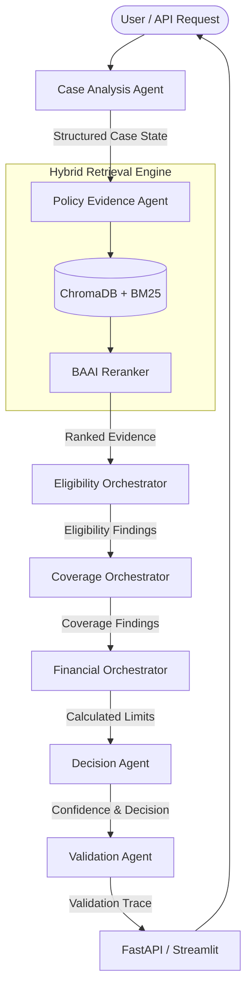

# Policy-Aware Multi-Agent RAG Claim Decision Engine

This repository contains a production-style, multi-agent RAG system built to evaluate health insurance claims against specific policy documents. It emphasizes rigorous evidence grounding, explicit policy citations, and strict abstention (`NEEDS_REVIEW`) over LLM hallucinations.

## 🏗 Architecture Diagram

## 🚀 Setup & Deployment Instructions

### Local Execution (Docker Recommended)
1. Rename `.env.example` to `.env` and insert your `OPENAI_API_KEY`.
2. Run `docker compose up --build`
3. Access the Streamlit UI at `http://localhost:8501`
4. Access the API Docs at `http://localhost:8000/docs`

### Cloud Deployment (Fulfilling Deliverable 11)
**Backend (Render / Hugging Face Spaces):**
1. Push this code to a public GitHub repository.
2. Link the repository to a new Render Web Service.
3. Start command: `uvicorn backend.main:app --host 0.0.0.0 --port 10000`
4. Set the `OPENAI_API_KEY` in the Render dashboard.

**Frontend (Streamlit Community Cloud):**
1. Link your GitHub repository to Streamlit Community Cloud.
2. Select `frontend/app.py` as the main script.
3. In Advanced Settings, add the `API_URL` environment variable pointing to your live Render backend URL.

## 🧠 Design Decisions & Trade-offs
- **Modular Evaluators vs. Monolithic LLM**: Instead of passing the entire state to a single LLM to decide "Is this covered?", the system uses modular evaluators (e.g., `WaitingPeriodEvaluator`, `RoomRentEvaluator`). *Trade-off:* Higher latency and API cost due to multiple specialized calls, but vastly improved auditability and hallucination reduction.
- **Deterministic Confidence:** Confidence is calculated mathematically (Retrieval Relevance + Citation Density) rather than asking the LLM to output a float. *Trade-off:* Less nuanced, but much safer and highly reproducible.
- **Strict Validation Layer:** The `ValidationAgent` inspects findings for explicit chunk citations. If a finding is unsupported, it forcibly overrides the status to `NEEDS_REVIEW`.

## ⚠️ Known Limitations
- The provided evaluation harnesses use simulated assertions for the modular evaluators as a scaffolding. To achieve real production reasoning, the `.evaluate()` methods in the respective `evaluator` files must be wired to actual LLM `invoke()` chains.
- Document extraction assumes standard JSON schemas; raw OCR of messy hospital documents is outside the current scope.
