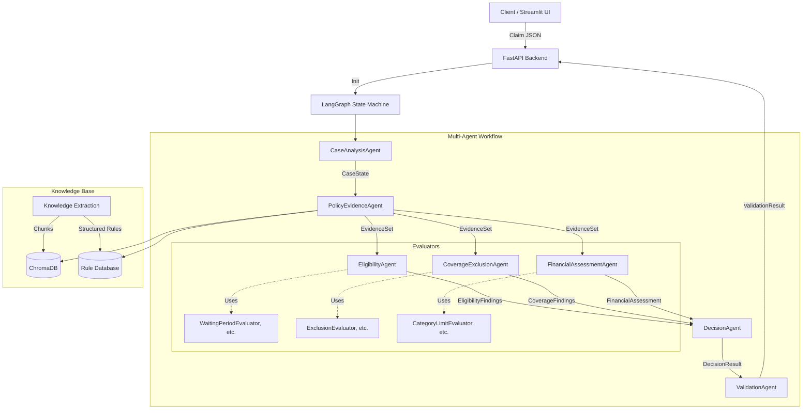

# Policy-Aware Multi-Agent RAG Claim Decision Engine

This document outlines the architecture, folder structure, state models, agent contracts, and retrieval design for the Policy-Aware Multi-Agent RAG Claim Decision Engine.

## Architecture Diagram



## Folder Structure

```text
backend/
  api/
    routes.py
    dependencies.py
  core/
    config.py
    exceptions.py
  models/
    state.py            # Pydantic v2 state models
    api.py              # Request/Response models
    policy.py           # Structured Policy Rule models
  agents/
    graph.py            # LangGraph workflow definition
    case_analysis.py
    policy_evidence.py
    decision.py
    validation.py
    evaluators/
      eligibility/
        waiting_period.py
        hospital_definition.py
      coverage/
        exclusion.py
        medical_necessity.py
      financial/
        room_rent.py
        category_limits.py
    orchestrators/
      eligibility.py    # EligibilityAgent
      coverage.py       # CoverageExclusionAgent
      financial.py      # FinancialAssessmentAgent
  retrieval/
    indexer.py          # Policy-aware chunking & Structured rule extraction
    hybrid.py           # Vector + BM25 + Structured lookup
  utils/
    logger.py
    confidence.py       # Deterministic confidence scoring
frontend/
  app.py                # Streamlit UI
  components/
    claim_upload.py
    results_view.py
evaluation/
  metrics.py
  retrieval_recall.py
  retrieval_precision.py
  citation_accuracy.py
  public_case_runner.py # Automated runner for the 12 public cases
  report_generator.py
tests/
  unit/
  integration/
  e2e/
data/
  policy.pdf
  schema/
  cases/                # 12 public evaluation cases
docs/
  architecture.md
docker-compose.yml
Dockerfile
.env.example
requirements.txt
README.md
```

## State Models (Pydantic v2)

```python
from pydantic import BaseModel, Field
from typing import List, Dict, Optional, Any, Literal

# --- Structured Knowledge Models ---
class PolicyRule(BaseModel):
    rule_type: Literal["PolicyDefinition", "CoverageClause", "ExclusionClause", "WaitingPeriodRule", "LimitRule", "BenefitRule"]
    content: str
    metadata: Dict[str, Any]

# --- State Models ---
class Citation(BaseModel):
    page: str
    section: str
    chunk_id: str
    source: str
    text: str

class Finding(BaseModel):
    description: str
    citations: List[Citation]
    is_supported: bool = True

class EvidenceItem(BaseModel):
    category: str
    content: str
    citation: Citation
    relevance_score: float
    is_structured_rule: bool = False

class CaseState(BaseModel):
    case_id: str
    claim_data: Dict[str, Any]
    decision_dimensions: List[str]
    missing_initial_evidence: List[str]
    investigation_plan: List[str]

class EvidenceSet(BaseModel):
    definitions: List[EvidenceItem]
    coverage_clauses: List[EvidenceItem]
    exclusions: List[EvidenceItem]
    limits: List[EvidenceItem]

class EligibilityFindings(BaseModel):
    findings: List[Finding]
    hospitalization_eligible: bool
    waiting_period_met: bool
    portability_adjustments: bool
    hospital_definition_met: bool
    domiciliary_eligible: bool
    day_care_eligible: bool
    missing_evidence: List[str]

class CoverageFindings(BaseModel):
    findings: List[Finding]
    covered_benefits: List[str]
    applied_exclusions: List[str]
    is_experimental: bool
    medical_necessity_established: bool
    missing_evidence: List[str]

class FinancialAssessment(BaseModel):
    findings: List[Finding]
    limits_applied: Dict[str, float]
    total_admissible_amount: float
    missing_evidence: List[str]

DecisionStatus = Literal[
    "ADMISSIBLE", 
    "ADMISSIBLE_WITH_LIMITS", 
    "PARTIALLY_ADMISSIBLE", 
    "NOT_ADMISSIBLE", 
    "NEEDS_REVIEW", 
    "INSUFFICIENT_EVIDENCE"
]

class DecisionResult(BaseModel):
    status: DecisionStatus
    confidence: float
    reasoning: str
    key_findings: List[Finding]

class ValidationResult(BaseModel):
    is_valid: bool
    validation_errors: List[str]
    unsupported_claims: List[str]

class ExecutionTraceStep(BaseModel):
    agent: str
    action: str
    timestamp: str
    retrieval_time_ms: Optional[int]
    rerank_time_ms: Optional[int]
    llm_time_ms: Optional[int]
    total_latency_ms: int
    token_usage: Optional[Dict[str, int]]
    retrieval_count: Optional[int]
    citation_count: Optional[int]

class OutputContract(BaseModel):
    case_id: str
    decision: DecisionStatus
    confidence: float
    key_findings: List[Finding]
    applicable_limits: List[Dict[str, Any]]
    missing_evidence: List[str]
    citations: List[Citation]
    validation: ValidationResult
    trace: List[ExecutionTraceStep]
```

## Agent Contracts & Evaluators

1. **CaseAnalysisAgent**: Parses raw JSON, validates schema, flags explicitly missing required claim documents.
2. **PolicyEvidenceAgent**: Retrieves chunks and structured Policy Rules (Definitions, Exclusions, Limits) using Hybrid Retrieval + Reranking.
3. **EligibilityAgent**: Acts as an orchestrator. Internally uses dedicated Evaluators, which output structured `Finding`s with explicit citations:
   - `WaitingPeriodEvaluator`, `DiseaseSpecificWaitingPeriodEvaluator`, `PreExistingDiseaseEvaluator`
   - `PortabilityEvaluator`
   - `HospitalDefinitionEvaluator`
   - `DayCareEvaluator`, `DomiciliaryTreatmentEvaluator`
4. **CoverageExclusionAgent**: Uses internal Evaluators:
   - `CoverageEvaluator`, `ExclusionEvaluator`, `CosmeticTreatmentEvaluator`, `ExperimentalTreatmentEvaluator`, `MedicalNecessityEvaluator`
5. **FinancialAssessmentAgent**: Uses internal Evaluators:
   - `RoomRentLimitEvaluator`, `CategoryLimitEvaluator`, `AmbulanceLimitEvaluator`, `DomiciliarySubLimitEvaluator`, `PreHospitalizationEvaluator`, `PostHospitalizationEvaluator`
6. **DecisionAgent**: Aggregates Findings. Applies deterministic confidence score. Prioritizes abstention (`NEEDS_REVIEW` / `INSUFFICIENT_EVIDENCE`) if critical findings lack sufficient citation or hospital/necessity cannot be verified. 
7. **ValidationAgent**: Iterates over every `Finding` in the final output. Verifies that 1) citations exist, 2) citations map to retrieved evidence, and 3) the cited text logically supports the finding. Rejects unsupported claims, downgrades confidence, or flips status to `NEEDS_REVIEW`.

## Deterministic Confidence Scoring

Confidence is computed via a deterministic formula implemented in `utils/confidence.py`:

```python
confidence = (
    0.35 * retrieval_quality +    # Based on reranker scores of utilized evidence
    0.25 * citation_coverage +    # Ratio of material findings that have valid citations
    0.25 * evidence_agreement +   # Assessment of conflicting evidence or lack thereof
    0.15 * completeness           # Completeness of provided claim documents
)
```

## Evaluation Framework

- **`public_case_runner.py`**: Executes the pipeline over the 12 provided public cases and generates `evaluation_report.json`.
- **Retrieval Metrics**: Recall@K, MRR, Citation Hit Rate, Precision, and Coverage. Evaluated using `retrieval_recall.py` and `retrieval_precision.py`.
- **System Metrics**: Decision Accuracy, Citation Accuracy, Abstention Accuracy, and Hallucination Rate. 
